# (C# 코딩) 그림판
## 개요
- C# 프로그래밍 학습
- 1줄 소개: 사용자 편의를 고려한 부드러운 확대/축소와 정밀한 드래그 미리보기를 지원하며, 다양한 포맷으로 저장 가능한 스마트 그래픽 편집 도구입니다.

- 사용한 플랫폼: 
	- C#, .NET Windows Forms, Visual Studio, GitHub
- 사용한 컨트롤:
		-Button, Label, ComboBox, TrackBar, PictureBox
	- 사용한 기술과 구현한 기능:
		- ui 구성 : 도형선택,색선택,굵기선택,캔버스 구성
		- 도형선택: 버튼 3개를 이용해서 직선, 사각형,원 선택
		- 색선택: combobox를 이용해서 색 선택
		- 선두께선택: trackbar를 이용해서 선 굵기 선택
		- 캔버스: picturebox를 이용해서 그림 그릴 수 있는 공간 구성

## 실행 화면 (과제1)- 코드의 실행 스크린샷과 구현 내용 설명
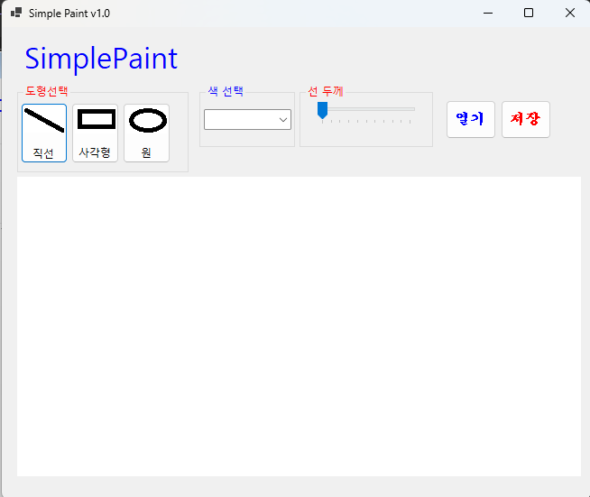
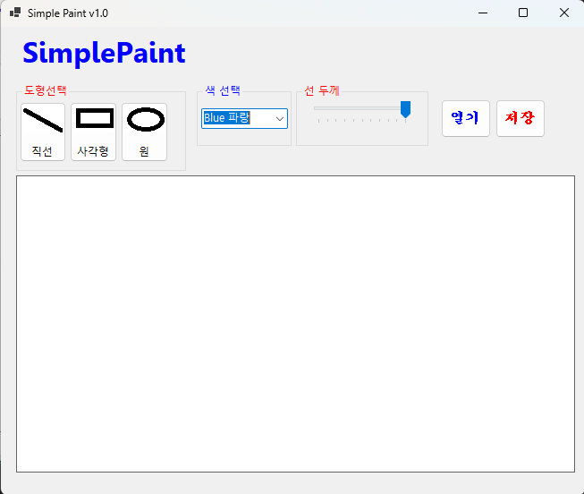
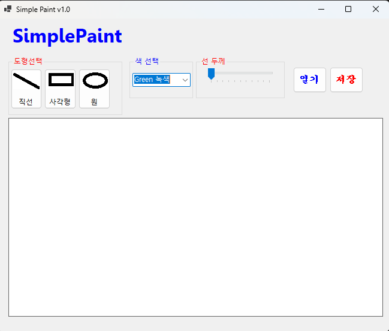
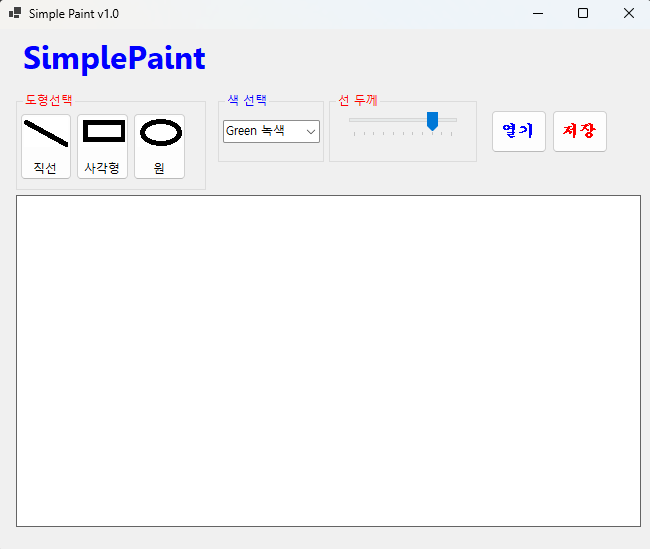

핵심 구현 내용: UI 구성 및 환경 설정
도형 선택: 선, 사각형, 원을 선택할 수 있는 버튼 구현.

색상 및 두께: ColorDialog를 통한 색상 선택 기능 및 TrackBar를 활용한 선 두께(Pen Width) 조절 기능.

레이아웃: Anchor 속성을 활용하여 창 크기 조절 시 UI 요소들이 자연스럽게 배치되도록 설정.

## 실행 화면 (과제2)- 코드의 실행 스크린샷과 구현 내용 설명
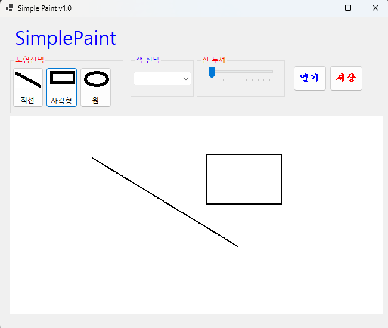
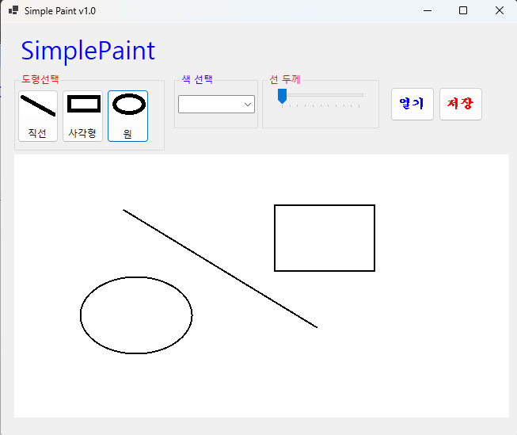
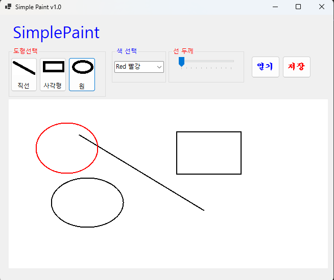
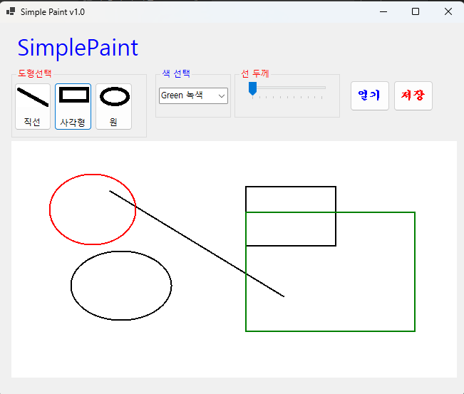
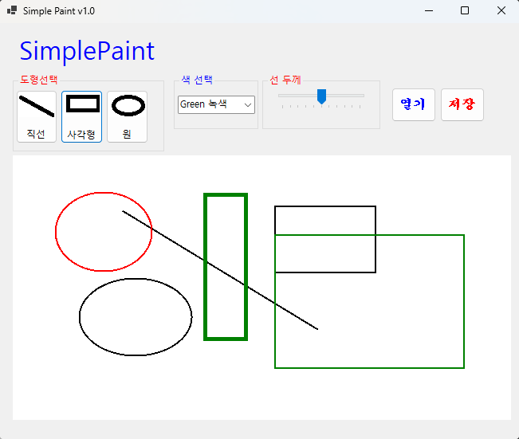

핵심 구현 내용: 실시간 도형 그리기 logic
마우스 이벤트: MouseDown, MouseMove, MouseUp 이벤트를 조합하여 자유로운 드래그 드로잉 구현.

실시간 미리보기: 드래그 중에는 Paint 이벤트를 통해 점선(DashStyle) 형태의 가이드라인을 표시하여 사용자 편의성 증대.

그래픽 처리: Bitmap과 Graphics 객체를 사용하여 그린 도형이 지워지지 않고 도화지에 유지되도록 구현.

## 실행 화면 (과제3)- 코드의 실행 스크린샷과 구현 내용 설명
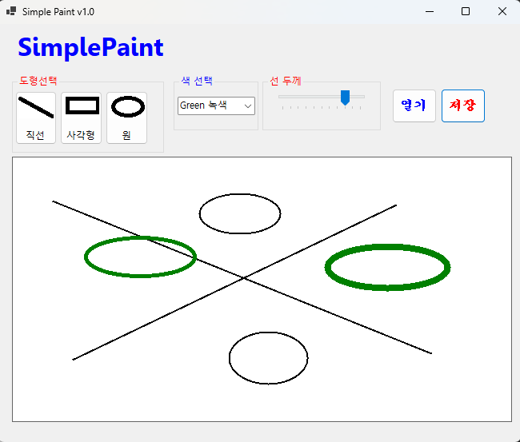

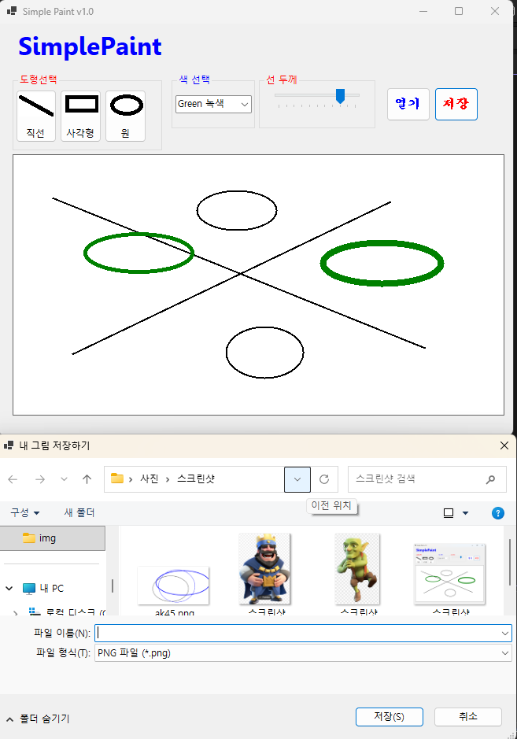
(이미지 다운로드 과정)
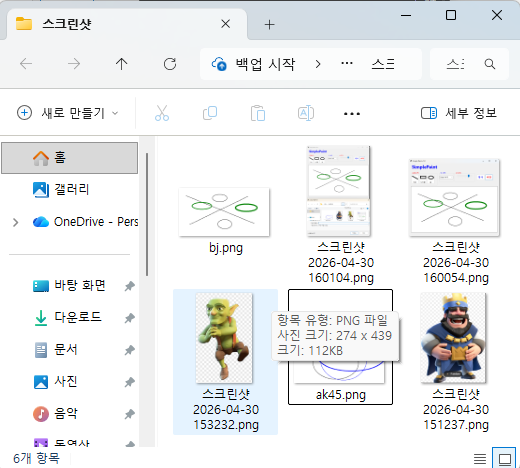
(이미지 다운 확인 폴더)
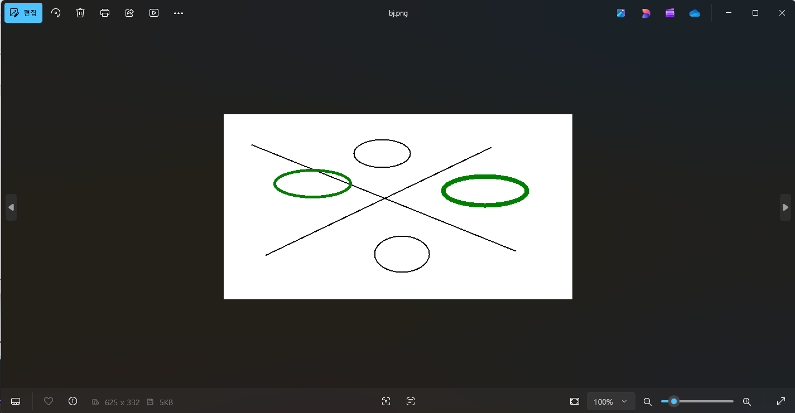
(이미지 다운로드 확인)

핵심 구현 내용: 파일 저장 기능
다양한 포맷 지원: SaveFileDialog를 사용하여 사용자가 원하는 위치에 파일 저장 가능.

확장자 필터: PNG, JPG, BMP 3가지 주요 이미지 포맷 선택 기능 제공.

이미지 병합: 도화지(Bitmap)에 그려진 모든 도형 데이터를 선택한 포맷에 맞춰 손실 없이 저장.

## 실행 화면 (과제4)- 코드의 실행 스크린샷과 구현 내용 설명
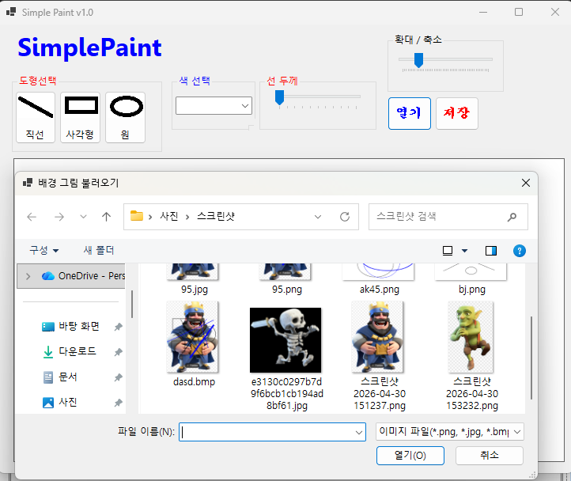
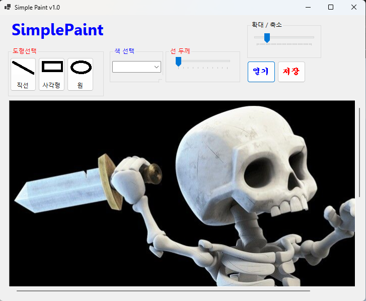
(이미지 파일 업로드)
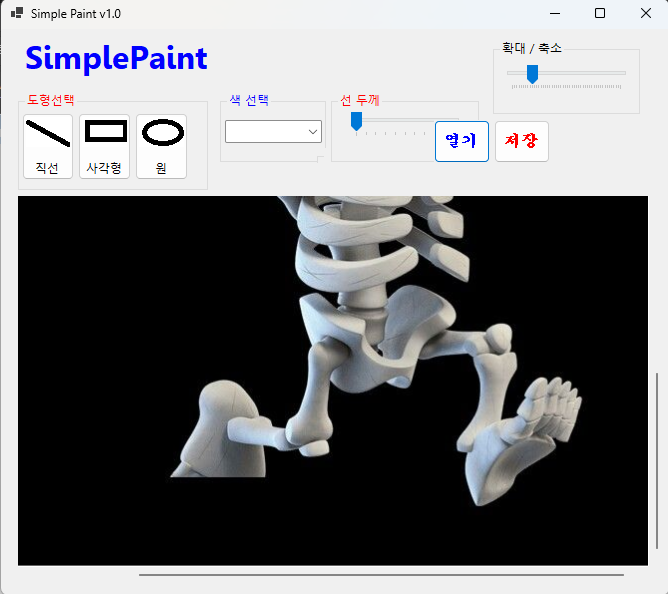
(이미지 파일을 스코롤 바를 이용해 축소)
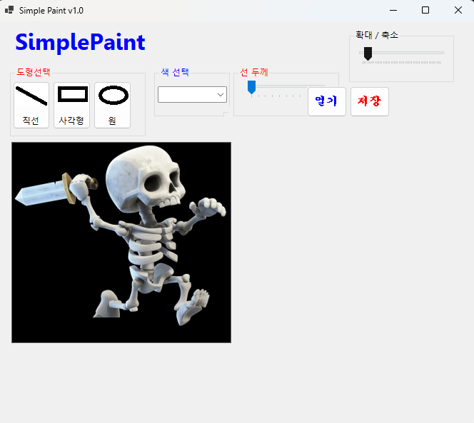
(이미지 파일을 확대/축소바를 이용해 축소)
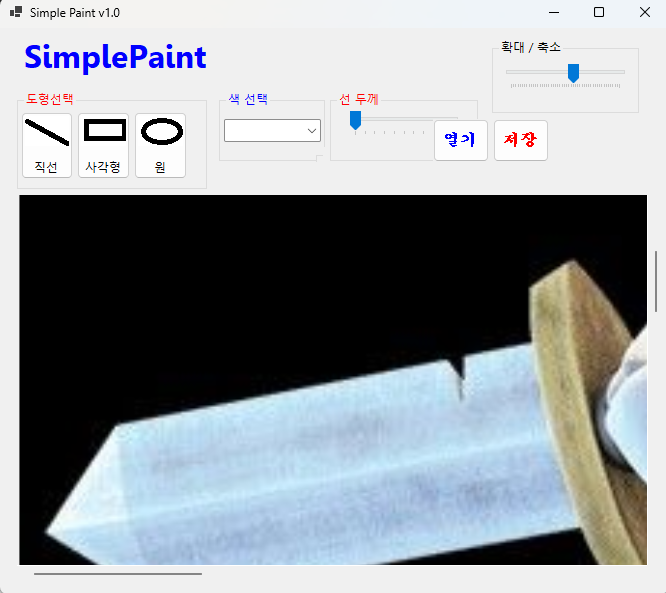
(이미지 파일을 확대/축소바를 이용해 확대)

핵심 구현 내용: 이미지 편집 및 고도화
외부 이미지 로드: OpenFileDialog를 통해 배경으로 쓸 이미지 파일을 불러오는 기능.

스크롤 시스템: 이미지 크기가 창보다 클 경우 Panel의 AutoScroll 기능을 통해 자유로운 화면 이동 가능.

정밀 확대/축소: TrackBar를 활용하여 0.1배에서 5.0배까지 소수점 단위의 부드러운 Zoom In/Out 구현.

좌표 보정: 이미지 확대 시에도 마우스 클릭 위치와 실제 드로잉 위치가 일치하도록 배율 기반 좌표 계산 로직 적용.